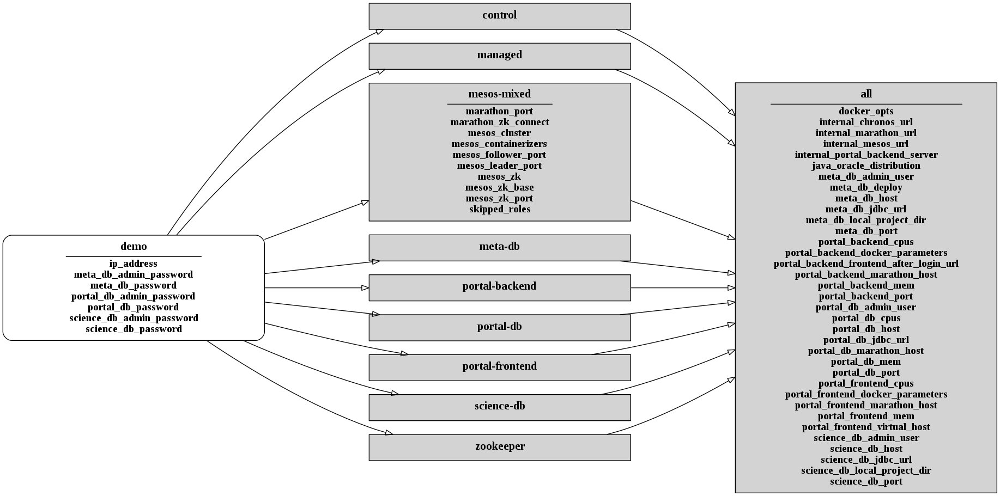

# Portal demo

Demonstration of MIP web portal and its environment running inside a Vagrant Virtual machine.

## Installation

* install [Ansible](https://www.ansible.com/) version 2.2.0 or better. On Ubuntu you can use the script ./common/scripts/bootstrap.sh
* install [VirtualBox](https://www.virtualbox.org/) version 5.0 or better
* install [Vagrant](https://www.vagrantup.com/) version 1.8.5 or better
* install vagrant plugin install vagrant-hostmanager

  ```
     vagrant plugin install vagrant-hostmanager
  ```
* start the virtual machine with Vagrant

  ```
    vagrant up
  ```

### Troubleshooting

#### VirtualBox is complaining that the installation is incomplete

After upgrading the Linux kernel in your system you may encounter this message when running a Vagrant command:

```
The provider 'virtualbox' that was requested to back the machine
'airflow' is reporting that it isn't usable on this system. The
reason is shown below:

VirtualBox is complaining that the installation is incomplete. Please
run `VBoxManage --version` to see the error message which should contain
instructions on how to fix this error.
```

To fix it, you need to rebuild a module for Virtualbox using this command:

```
  sudo apt-get install --reinstall virtualbox-dkms linux-headers-generic
```

## Usage

The virtual machine should start and install the MIP portal.

The portal should be accessible from [localhost:18080](http://localhost:18080)

Marathon can be accessed on [localhost:15080](http://localhost:15080)

## Testing

TODO: provide example data and some tests

## For developers

### Sources for Portal and related projects

| Portal | Organisation | License | Management | Continuous integration |
|--------|--------------|---------|------------|------------------------|
| [portal-specs](https://github.com/HBPMedical/portal-specs) | [](https://www.unil.ch/lren/en/home.html) |   |   |   |
| [portal-backend](https://github.com/HBPMedical/portal-backend) | [](https://www.unil.ch/lren/en/home.html) | [](https://www.gnu.org/licenses/agpl-3.0.html) |   | [](https://circleci.com/gh/LREN-CHUV/portal-backend/tree/master) <br/> [](https://www.codacy.com/app/mirco-nasuti/portal-backend?utm_source=github.com&amp;utm_medium=referral&amp;utm_content=LREN-CHUV/portal-backend&amp;utm_campaign=Badge_Grade) |
| [portal-frontend](https://github.com/HBPMedical/portal-frontend) | [](https://www.unil.ch/lren/en/home.html) | [](https://www.gnu.org/licenses/agpl-3.0.html) | [](https://trello.com/b/lr3NS4W6/dev-web-front-end) |   |
| [bootstrap-mip-app](https://github.com/HBPMedical/bootstrap-mip-app) | [](https://www.unil.ch/lren/en/home.html) | [](https://github.com/LREN-CHUV/bootstrap-mip-app/blob/master/LICENSE) |   |   |
| [sunburst](https://github.com/HBPMedical/sunburst) | [](https://www.unil.ch/lren/en/home.html) | [](https://github.com/HBPMedical/sunburst/blob/master/LICENSE) |   |   |

### Configuration for Ansible inventory

Ansible inventory controls what software is installed and how it is configured.

It is organised by hosts (servers) and groups.

Here, we have the following organisation:

* demo: the target host, running inside a Vagrant Virtual machine
* managed: a group containing demo, indicating that the server is managed by Ansible and should be applied a default configuration and a set of base sofware packages
* control: a group containing demo, indicating that this server is used to perform operations affecting the whole cluster (here we have a 'cluster' of one machine)
* zookeeper, mesos-mixed: groups that are used to define where and how the Mesos stack is deployed
* meta-db, research-db, portal-db, portal-backend, portal-frontend: groups that are used to define which applications should be deployed by Marathon

[]()
